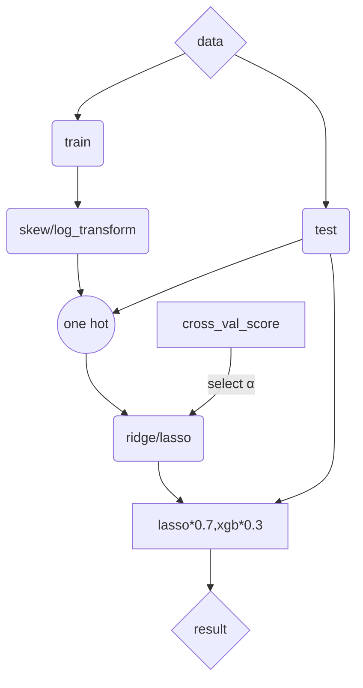

# Regularized Liner Model
Solutions for Kaggle "House Price Prediction"
***
## 1 Introduction
### 1.1 Competition Description
&emsp;Ask a home buyer to describe their dream house, and they probably won't begin with the height of the basement ceiling or the proximity to an east-west railroad. But this playground competition's dataset proves that much more influences price negotiations than the number of bedrooms or a white-picket fence.

&emsp;With 79 explanatory variables describing (almost) every aspect of residential homes in Ames, Iowa, this competition challenges you to predict the final price of each home

### 1.2 Statement
Originator：Alexandru Papiu
Analyzed：Tinky Wu
### 1.3 Basic Ideas


## 2 Data Processing
### 2.1 Import package and load data
```python
import pandas as pd
import numpy as np
import seaborn as sns
import matplotlib
import matplotlib.pyplot as plt
from scipy.stats import skew
from scipy.stats.stats import pearsonr
%matplotlib inline
```
```python
train = pd.read_csv("../input/train.csv")
test = pd.read_csv("../input/test.csv")
```
### 2.2 Data exploration
First, let's look at the basic data
```python
train.head()
```

```python
data.info()
```

### 2.3 Preprocessing
```python
all_data = pd.concat((train.loc[:,'MSSubClass':'SaleCondition'],
					  test.loc[:,'MSSubClass':'SaleCondition'])) 
					  #Process the dataset together

matplotlib.rcParams['figure.figsize'] = (12.0, 6.0)
#{ rcParams } Set the Image pixel, 'rc' means configuration

prices = pd.DataFrame({"price":train["SalePrice"], 
					   "log(price + 1)":np.log1p(train["SalePrice"])})
prices.hist()
```

We can see that we have transformed srewed values after the log transform
```python
train["SalePrice"] = np.log1p(train["SalePrice"]) 
#log transform the target

numeric_feats = all_data.dtypes[all_data.dtypes != "object"].index
#log transform skewed numeric features
#If all the data in the column is not object, the column will be selected

skewed_feats = train[numeric_feats].apply(lambda x: skew(x.dropna())) #compute skewness, just for the training set

skewed_feats = skewed_feats[skewed_feats > 0.75]
#Choose the numeric column that skewness>0.75

skewed_feats = skewed_feats.index
all_data[skewed_feats] = np.log1p(all_data[skewed_feats])
#Transform the chosen columns
```
### 2.4 One-Hot Encoding 
```python
#fill the missing value and create matrices for sklearn
all_data = pd.get_dummies(all_data)
all_data = all_data.fillna(all_data.mean()) #filling NA's with the mean of the column
X_train = all_data[:train.shape[0]]
X_test = all_data[train.shape[0]:]
y = train.SalePrice
```

## 3 Modeling
After the simple transform, now using regularized linear regression models
The author tried both l_1(Lasso) and l_2(Ridge) regularization
He also defined a function that returns the cross-validation rmse to evaluate the model
### 3.1 Basic Model: Ridge & Lasso
```python
from sklearn.linear_model import Ridge, RidgeCV, ElasticNet, LassoCV, LassoLarsCV
from sklearn.model_selection import cross_val_score
```
【rmse】：root-mean-square error: Measures the deviation between Observed value and Truth-value
```python
def rmse_cv(model):
    rmse= np.sqrt(-cross_val_score(model, X_train, y, scoring="neg_mean_squared_error", cv = 5))
    return(rmse)
model_ridge = Ridge()
```
higher alpha means more restriction on coefficient 'w' (May improve the generalization performance and avoid overfit)
```python
alphas = [0.05, 0.1, 0.3, 1, 3, 5, 10, 15, 30, 50, 75]  # Adjusting parameters
cv_ridge = [rmse_cv(Ridge(alpha = alpha)).mean() for alpha in alphas]
#Visualization: alphas-rmse
cv_ridge = pd.Series(cv_ridge, index = alphas)
cv_ridge.plot(title = "Validation - Just Do It")
plt.xlabel("alpha")
plt.ylabel("rmse")
```

Now we check the Root Mean Squared Logarithmic Error(The smaller the better)
```python
cv_ridge.min()
```

Next we try Lasso
```python
model_lasso = LassoCV(alphas = [1, 0.1, 0.001, 0.0005]).fit(X_train, y)
rmse_cv(model_lasso).mean()
```

Lasso  does feature selection for you - setting coefficients of features it deems unimportant to zero. It performs somewhat better than ridge model.
### 3.2 Check the model
Check how many features it choose
```python
coef = pd.Series(model_lasso.coef_, index = X_train.columns)
print("Lasso picked " + str(sum(coef != 0)) + " variables and eliminated the other " +  str(sum(coef == 0)) + " variables")
```

Take a look directly at what the most important coefficients are
```python
imp_coef = pd.concat([coef.sort_values().head(10),coef.sort_values().tail(10)])
matplotlib.rcParams['figure.figsize'] = (8.0, 10.0)
imp_coef.plot(kind = "barh")
plt.title("Coefficients in the Lasso Model")
```

These are actual coefficients ’w‘ in your model
It's easier to explain the predicted price concluded by the model

Now we check the residuals
```python
matplotlib.rcParams['figure.figsize'] = (6.0, 6.0)
preds = pd.DataFrame({"preds":model_lasso.predict(X_train), "true":y})
preds["residuals"] = preds["true"] - preds["preds"]
preds.plot(x = "preds", y = "residuals",kind = "scatter")
```

### 3.3 Add another model: xgboost
```python
import xgboost as xgb
dtrain = xgb.DMatrix(X_train, label = y)
dtest = xgb.DMatrix(X_test)
params = {"max_depth":2, "eta":0.1}
model = xgb.cv(params, dtrain,  num_boost_round=500, early_stopping_rounds=100)
model.loc[30:,["test-rmse-mean", "train-rmse-mean"]].plot()#visualize the rmse-mean changing
```

```python
model_xgb = xgb.XGBRegressor(n_estimators=360, max_depth=2, learning_rate=0.1) #the params were tuned using xgb.cv
model_xgb.fit(X_train, y)
```
## 4 Predicting
```python
xgb_preds = np.expm1(model_xgb.predict(X_test))
lasso_preds = np.expm1(model_lasso.predict(X_test))
predictions = pd.DataFrame({"xgb":xgb_preds, "lasso":lasso_preds})
predictions.plot(x = "xgb", y = "lasso", kind = "scatter")
```

Take a weighted average
```python
preds = 0.75*lasso_preds + 0.25*xgb_preds #Take a weighted average of uncorrelated results
solution = pd.DataFrame({"id":test.Id, "SalePrice":preds})
solution.to_csv("ridge_sol.csv", index = False)
```
## 5 Results

If there's any flow, please point out. Thank you!


